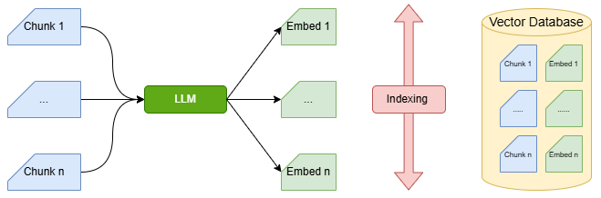
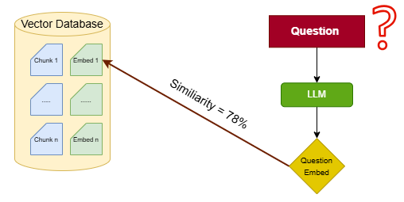
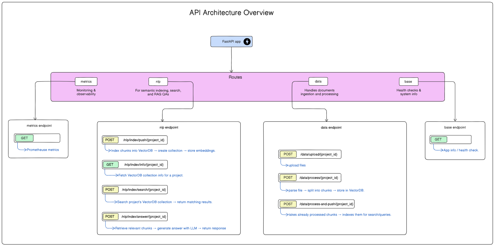
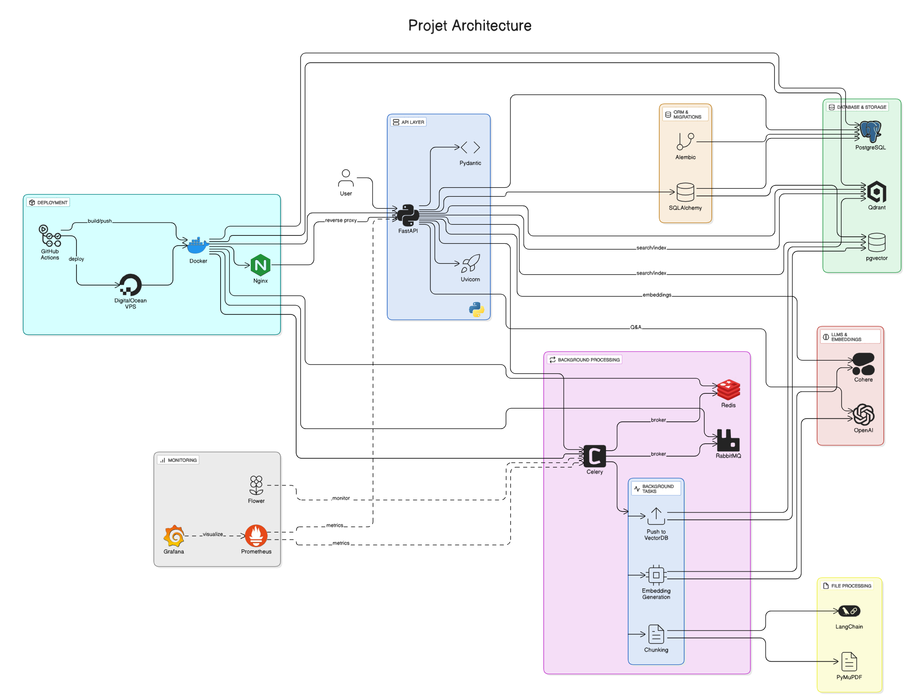

# Rag application

An implementation of a Retrieval-Augmented Generation (RAG) model for question answering application.
This app allows users to upload documents and ask questions, returning context-aware answers based on the uploaded content.

## Table of Contents

- [Technologies](#technologies)
  - [Languages and Frameworks](#languages-and-frameworks)
  - [Databases](#databases)
  - [ORM & Migrations](#orm--migrations)
  - [LLM Providers](#llm-providers)
  - [Utilities](#utilities)
- [RAG Application Workflow](#rag-retrieval-augmented-generation-application-workflow)
  - [1. Upload a Document](#1-upload-a-document)
  - [2. Process the Document](#2-process-the-document)
  - [3. Search for Similar Documents](#3-search-for-similar-documents-semantic-search)
  - [4. Generate the Answer](#4-generate-the-answer)
- [Project Architecture](#project-architecture)
  - [API Architecture Overview](#api-architecture-overview)
  - [Project Architecture Overview](#project-architecture-overview-1)
- [Requirements](#requirements)
- [Installation](#installation)
  - [Install Dependencies](#install-dependencies)
  - [Install Python using MiniConda](#install-python-using-miniconda)
  - [Install the Required Packages](#install-the-required-packages)
  - [Setup Environment Variables](#setup-the-environment-variables)
- [Running the Application](#running-the-application)
  - [Run the FastAPI Server](#run-the-fastapi-server)
  - [Run Docker Compose Service](#run-docker-compose-service)
- [Optional Setup](#optional-setup)

---

## Technologies

### Languages and Frameworks


### Databases


### ORM & Migrations


### LLM Providers


### Utilities


## RAG (Retrieval-Augmented Generation) Application Workflow

Traditional language models (LLMs) generate answers based only on the knowledge they were trained on. This can lead to outdated or hallucinated responses, especially when dealing with domain-specific or dynamic information.

`Retrieval-Augmented Generation (RAG)` Architecture solves this by combining the power of information retrieval and language generation. Instead of relying solely on the model's internal knowledge, RAG pipelines retrieve relevant documents from an external knowledge base and use them to ground the model's answers.

In a typical RAG pipeline: 

### 1. Upload a Document

- The user uploads one or more documents (PDF, TXT, etc.) to be used as the knowledge base.

### 2. Process the Document

This step involves:

- Extracting text from the uploaded files.
- Chunking the extracted text into smaller pieces (documents/passages).
- Parsing and cleaning the data as needed.


**Indexing**



- The chunks are converted into embeddings using an embedding model.
- The embeddings are stored in a vector store for efficient similarity search.

### 3. Search for Similar Documents (Semantic Search)

When a query is submitted:

- The query is converted into an embedding.
- A similarity search is performed against the vector store to retrieve the most relevant chunks.



### 4. Generate the Answer

- A prompt is constructed using the user query and retrieved documents.
- The prompt is passed to an LLM (Large Language Model).
- The LLM returns a response grounded in the relevant information.


## Project Architecture

### API Architecture Overview



This API architecture is built with FastAPI and provides routes for monitoring, document ingestion, semantic indexing, and health checks. Documents can be uploaded, processed into chunks, stored in a VectorDB, and then queried for search or Q&A with an LLM. Metrics endpoints support observability, while base endpoints handle system and health information.

### Project Architecture Overview



This architecture enables users to upload documents and query them through a FastAPI backend. Document processing runs in the background via Celery, where text is extracted (using PyMuPDF and Tesseract), converted into vector embeddings with Cohere, and stored in Qdrant. When a question is asked, the system retrieves the most relevant document chunks and leverages LangChain to generate a context-aware response. The entire solution is containerized with Docker, deployed on DigitalOcean, and monitored using Prometheus and Grafana.

## Requirements

- Python 3.12

## Installation

### Install Dependencies

To run this project on Windows, follow these steps:
- Install WSL and Ubuntu for Windows ([Tutorial](https://www.youtube.com/watch?v=IL7Jd9rjgrM))
- Open your Ubuntu terminal and update the package lists:

```bash
sudo apt update
```

### Install Python using MiniConda

- Download and install MiniConda in ubuntu from [here](https://www.anaconda.com/docs/getting-started/miniconda/install)
- Create a new environment using the following command:

```bash
$ conda create -n <env_name> python=3.12
```

- Activate the environment:

```bash
$ conda activate <env_name>
```

### Install the Required Packages

#### Prerequisites for Linux/WSL

Before installing the Python dependencies, ensure that the required system packages are installed to avoid compilation or runtime errors:

```bash
$ sudo apt update 
$ sudo apt install libpq-dev gcc python3-dev
```

Once the system packages are in place, install the Python dependencies from the requirements file:

```bash
$ pip install -r requirements.txt
```

### Setup the Environment Variables

Set your environment variables in the `.env` file. 

```bash
$ cp .env.example .env
```

## Running the Application

### Run the FastAPI Server

You can run the FastAPI server using Uvicorn.

- Run the server locally: 

```bash
$ uvicorn main:app --reload 
```

- Run the server with custom host and port:

```bash
$ uvicorn main:app --reload --host 0.0.0.0 --port 5000
```

### Run Docker Compose Service

Copy `.env.example` in your `.env` and update it with your credentials.

```bash
$ cd docker
$ cp .env.example .env
```

## Optional Setup

Setup your command line interface for better readability:

```bash
export PS1="\[\033[01;32m\]\u@\h:\w\n\[\033[00m\]\$ "
```