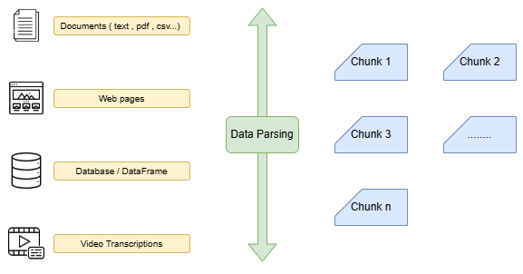
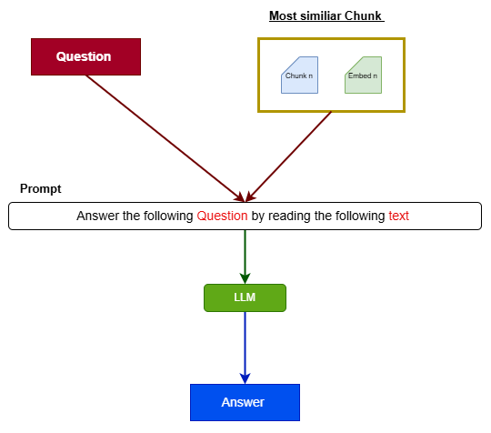

# Rag application 

<!-- Python -->


<!-- FastAPI -->


<!-- LLMs -->


<!-- Vector Database -->


<!-- Database & Migration -->


<!-- Tunneling -->


An implementation of a Retrieval-Augmented Generation (RAG) model for question answering.
This app allows users to upload documents and ask questions, returning context-aware answers based on the uploaded content.


# RAG (Retrieval-Augmented Generation) Application Workflow :

Traditional language models (LLMs) generate answers based only on the knowledge they were trained on. This can lead to outdated or hallucinated responses, especially when dealing with domain-specific or dynamic information.

`Retrieval-Augmented Generation (RAG)` Architeture solves this by combining the power of information retrieval and language generation. Instead of relying solely on the model’s internal knowledge, RAG pipelines retrieve relevant documents from an external knowledge base and use them to ground the model's answers.

In a typical RAG pipeline: 

### 1. Upload a Document:

- The user uploads one or more documents (PDF, TXT, etc.) to be used as the knowledge base.


### 2. Process the Document :

This step involves:

- Extracting text from the uploaded files.

- Chunking the extracted text into smaller pieces (documents/passages).

- Parsing and cleaning the data as needed.




**Indexing**


- The chunks are converted into embeddings using an embedding model.

- The embeddings are stored in a vector store for efficient similarity search.

### 3. Search for Similar Documents (`Semantic Search`):

When a query is submitted:

- The query is converted into an embedding.

- A similarity search is performed against the vector store to retrieve the most relevant chunks.


### 4. Generate the Answer :

- A prompt is constructed using the user query and retrieved documents.

- The prompt is passed to an LLM (Large Language Model).

- The LLM returns a response grounded in the relevant information.



## Requirements :

- Python 3.12

### Install Dependencies

To run this project on Windows, follow these steps:
- Install WSL and Ubuntu for Windows ([Tutorial](https://www.youtube.com/watch?v=IL7Jd9rjgrM))
- Open your Ubuntu terminal and update the package lists:

```bash
sudo apt update
```

### Install Python using MiniConda

- Download and install MiniConda in ubuntu from [here](https://www.anaconda.com/docs/getting-started/miniconda/install)
- Create a new environment using the following command:

```bash
$ conda create -n <env_name> python=3.12
```

- Activate the environment:

```bash
$ conda activate <env_name>
```


## Installation : 

### Install the required packages

#### Prerequisites for Linux/WSL :

Before installing the Python dependencies, ensure that the required system packages are installed to avoid compilation or runtime errors:

```bash
$ sudo apt update 
$ sudo apt install libpq-dev gcc python3-dev
```
Once the system packages are in place, install the Python dependencies from the requirements file:

```bash
$ pip install -r requirements.txt
```

### Setup the environment variables

Set your environment variables in the `.env` file. 

```bash
$ cp .env.example .env
```

## Run the FastAPI server : 

You can run the FastAPI server using Uvicorn.

- Run the server locally : 

```bash
$ uvicorn main:app --reload 
```

- Run the server with custom host and port :

```bash
$ uvicorn main:app --reload --host 0.0.0.0 --port 5000
```


## Run docker compose service :

Copy `.env.example` in your `.env` and update it with your credentials.

```bash
$ cd docker
$ cp .env.example .env
```


